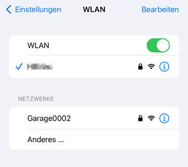
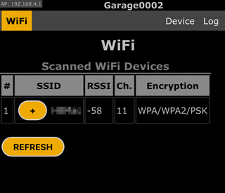
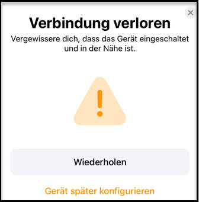
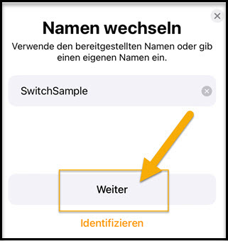
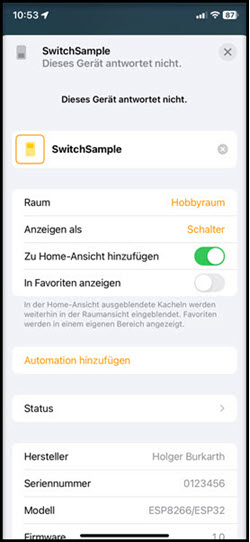
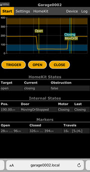
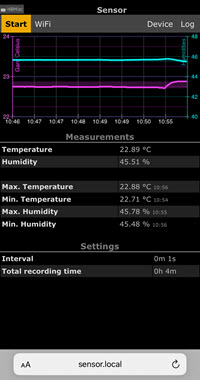
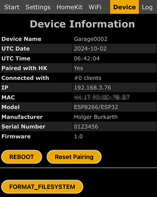
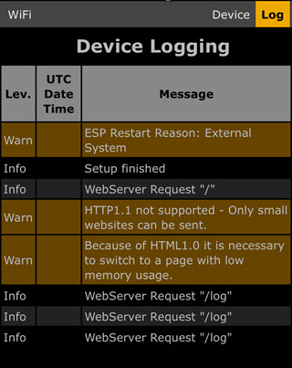

# Modern C++ Arduino HomeKit ESP8266

## Apple HomeKit accessory server library for ESP8266 Arduino with useful C++ support

  
Author: Holger Burkarth (burkarth at prodad.com)

### Features 

* This Arduino library is a native Apple HomeKit accessory implementation for the
[ESP8266 Arduino core](https://github.com/esp8266/Arduino) and works without any additional bridges.

* Simplifies the development of new IoT applications and reduces development, maintenance, and
debugging time with a comprehensive system.

* Enables easy deployment of application-specific websites on the IoT device. Navigation is
described by MenuItems. Each page has its own CSS, JavaScript, and HTML. Elements on a page
can be continuously updated using JavaScript without having to reload the entire page.
Buttons and other input elements are easy to create. A possible button reaction can be
automated through the system and thus greatly simplified.

* Information about the status of the process and problems is output via the serial port.
In addition, the latest events are recorded in a log and can be read at any time via the website.

* Complete frameworks are provided for special applications, which limit the implementation
effort to the pure changes. The GarageDoorOpener example is implemented with just a few lines
of source code. The opener is configured simply by adding units (see Host in GarageDoor.h).
 
> [!NOTE]
> This library has been compiled with the ESP8266 Arduino Core 3.1.2. Lower versions may compile with errors.

---

## Relevant source code and documentation

The documentation of the types, methods and functions is included in the source code.

- [hb_homekit.h](./src/hb_homekit.h) - General part of the library
- [HomeKit_GarageDoorOpener.h](./src/HomeKit_GarageDoorOpener.h) - Framework for garage door opener
    - [GarageDoor.h](./examples/GarageDoor/GarageDoor.h) - Example of a garage door opener
- [HomeKit_Sensor.h](./src/HomeKit_Sensor.h) - Framework for a sensor
    - [Sensor.h](./examples/Sensor/Sensor.h) - Example of a sensor (temperature, humidity, etc.)
- [HomeKit_Switch.h](./src/HomeKit_Switch.h) - Framework for a switcher
    - [Switch.h](./examples/Switch/Switch.h) - Example of a switcher
- [HomeKit_HeaterCooler.h](./src/HomeKit_HeaterCooler.h) - Framework for a header and cooler
    - [Heater.h](./examples/Heater/Heater.h) - Example of a header

---

## WiFi connection

Before getting started, one of the first steps is to establish a WiFi connection to
a local wireless network to communicate with Apple Home.

1. If there is no connection yet, the IoT device will set up its own local WiFi.
Find the name in the WiFi list (in this example, `Garage0002`).
Log in to that WiFi with the appropriate password (often `11111111`).  

2. Tap on the `+` button to select an available wireless network.  

3. Enter the password for the selected network.  

Once a connection is established, the logon information is permanently saved in the device. The device will restart automatically.

> :bulb: Stored data can be cleared by `FORMAT-FILESYSTEM` in the `Device` menu.  

---

## Connect to Apple Home

A new IoT device can be registered in just a few steps through the Home app.

1. Open the Home app and tap the `+` icon.
2. Use the `More Options` button to add the new device to the list.  

3. Select the new device. If it does not appear, check that
the new device has a WiFi connection to the shared WLAN.  
  
 The login code `1111-1111` is used in all examples.

4. It may happen that the process fails even though all requirements have been met.
In this case, the registration process must be repeated. Try several times if necessary.  

5. After successful registration, the device can be given a suitable name.  

6. The device is now available in the Home app and can be controlled.  

---

## Examples

### 1. Garage Door Opener

This example shows a garage door opener that can be controlled by
Apple HomeKit. The device uses the same function as a traditional
button to open the door. An ultrasonic distance sensor monitors
the position of the door to tell Apple HomeKit whether the door
is closed, open, or half open.

Read more: [Garage Door Opener Project](./examples/GarageDoor/README.md)
  
### 2. Sensor (Temperature, Humidity)

---

## Further technical details

### Device information web page

> [!NOTE]
> - `REBOOT` - restart the device
> - `RESET-PAIRING` - clear all pairing data
> - `FORMAT-FILESYSTEM` - clear the EEPROM stored data, but not the pairing data

---

### Log web page

---

### Storage

* The pairing data is stored in the `EEPROM` address in the ESP8266 Arduino core.
* This project does not use the `EEPROM' library with data cache to reduce memory usage (call flash_read and write directly).
* See comments in `storage.c' and [ESP8266-EEPROM-doc](https://arduino-esp8266.readthedocs.io/en/3.1.2/libraries.html#eeprom).

### Recommended Arduino IDE tools menu Settings

* LwIP variant: `v2 lower memory` (for lower memory usage)
* Debug level: `None` (for less memory usage)
* VTables: `Flash` (may not matter)
* Erase Flash: select `All Flash Contents` on first upload
* CPU frequency: `160MHz` (must)

---

### Troubleshooting

* Check your serial output. The library will print debug information to the serial port.
* Log output is also available on the device's web page.
* The following conditions are indicated by the blinking pattern of the built-in LED:
    * `##############--` | When at least one client is connected (WLAN connected, paired and Apple Home Client available)
    * `##--------------` | When no client is connected (WLAN connected and paired, Apple Home Client not available)
    * `#-------#-------` | Unpaired to HomeKit (WLAN connected)
    * `##--##----------` | AP (WiFi Access Point mode)
    * `#-#-#-#-#-#-#-#-` | Failed to connect to a WLAN (After about 10 seconds, alternatives are tried.)

### Change Log

#### v2.0.2 (2024-10-08)
* Support and examples for a sensor (temperature, humidity, etc.)
* Support and examples for a switcher

#### v2.0.0 (2024-10-01)

* Forked from Mixiao/Arduino-HomeKit-ESP8266
* Take over the project and make the necessary changes so that it can be compiled under Arduino IDE 2.3.2 (c++14).

