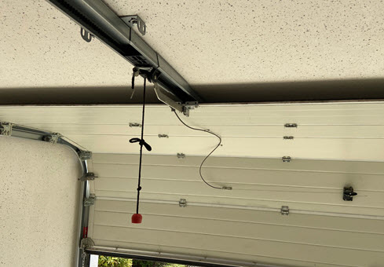
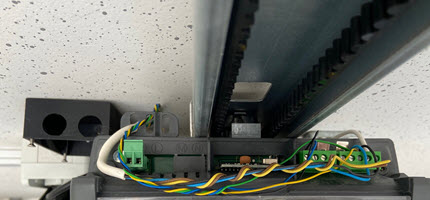
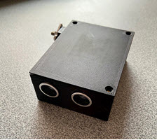
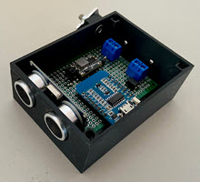
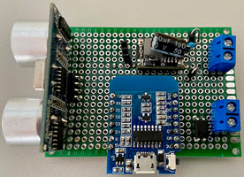
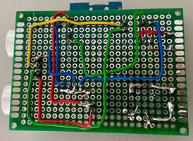
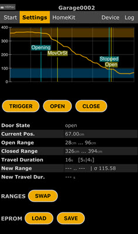
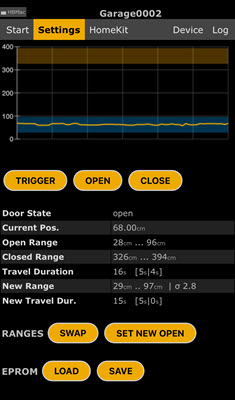
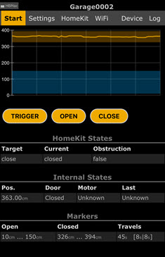
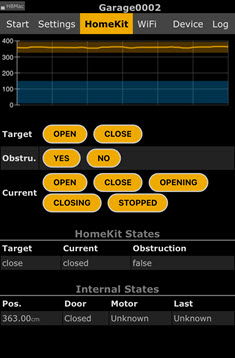

# Apple HomeKit Garage Door Opener as an IoT Device  

 Navigation: | [General Documentation](../../README.md) | **Garage Door Opener** |
|-|-|-|  

  
Author: Holger Burkarth (burkarth at prodad.com)

This example shows a garage door opener that can be controlled by
Apple HomeKit. The device uses the same function as a traditional
button to open the door. An ultrasonic distance sensor monitors
the position of the door to tell Apple HomeKit whether the door
is closed, open, or half open.

> New or different functions can be configured via CHost, derived
from CUnitBase, so that only a small amount of programming is
required, e.g. to detect the door position via limit switches or
to start the door motor other than by a pulse.

---

## Installation of the box and wiring of the door operator

The project can be used to control garage doors of this type.  


The garage door opener is installed in a black box (left) and connected to the door operator.  


Power is supplied from the 24 VAC provided by the door operator. As standard the door is
operated by a push button. A short pulse is sent to the door operator. The same cable
is also connected to the IoT device.  
> [!IMPORTANT]
> The ultrasonic distance sensor must be aligned so that the
top of the door is detected when the door is closed and the maximum distance is measured
when the door is closed.

---

## IoT device with PCB

The following images show a prototype.

   
(3D printed box)







---

## Compile and upload

The configuration of the garage door opener is done in the file `GarageDoor.h`. The following settings are available:

```cpp
/*
* @brief This pin is used to start the door motor by pulling the trigger pin HIGH for 100 ms.
* @note Make sure that this pin is set to LOW during booting so that
*       no trigger pulse is sent when restarting.
*       For example: D2 would be possible, but not D3.
*/
#define DOOR_PIN  D2


/* @brief The unit reads the door position from an ultrasonic sensor.
* The sensor is mounted at the top of the door and measures the distance to the door.
* @note Sensor: HC-SR04 Ultrasonic Sensor
* @node The EchoPin must be connected to an interrupt pin. (e.g.: D8)
*/
#define TRIGGER_PIN D7
#define ECHO_PIN    D8 // must be interrupt capable

```

---

## `Settings` web page - Configuring the Opener

1. The first step is to locate the closed and open positions of the door.
To do this, press the `OPEN` or `CLOSE` button to move the door.  


2. After reaching the end position, wait until a flat line appears on the graph.
The `SET NEW OPEN` or `SET NEW CLOSE` button will appear. Press this button to save
the current position as `OPEN` or `CLOSE`. Repeat the procedure for the other
direction to set the `OPEN` and `CLOSE` positions.  


3. Now press the `SAVE` button.

> :exclamation: Captured position data must be stored permanently.  
> :bulb: Reverse `OPEN` and `CLOSE` can be corrected using the `SWAP` button.  
> :bulb: The `SAVE` button permanently saves the current information and the `LOAD` button loads the last saved items.  

> [!NOTE]
>  - `TRIGGER` - Send a pulse to the door operator to start the motor 
>  - `OPEN` - move the door to the open position
>  - `CLOSE` - move the door to the closed position
>  - `SET NEW OPEN` - save the current position as `OPEN`
>  - `SET NEW CLOSE` - save the current position as `CLOSE`
>  - `SAVE` - save the current settings to EEPROM
>  - `LOAD` - load the last saved settings from EEPROM
>  - `SWAP` - exchange `OPEN` and `CLOSE` positions

---

## `Start` web page

Information about the device and its control options.  


> [!NOTE]
>  - `TRIGGER` - Send a pulse to the door operator to start the motor 
>  - `OPEN` - move the door to the open position
>  - `CLOSE` - move the door to the closed position

---

## `HomeKit` web page

Special information about HomeKit and the ability to change states to test
the behavior of Apple Home and the door opener.  


> [!NOTE]
>  - Target
>    - `OPEN` - sets the target characteristic state to open
>    - `CLOSED` - sets the target characteristic state to closed
>  - Current
>    - `OPEN` - sets the current characteristic state to open
>    - `CLOSE` - sets the current characteristic state to close
>    - `OPENING` - sets the current characteristic state to opening
>    - `CLOSING` - sets the current characteristic state to closing
>    - `STOPPED` - sets the current characteristic state to stopped
>  - ObstructionDetected
>    - `YES` - sets the obstruction detected characteristic state to true
>    - `NO` - sets the obstruction detected characteristic state to false
